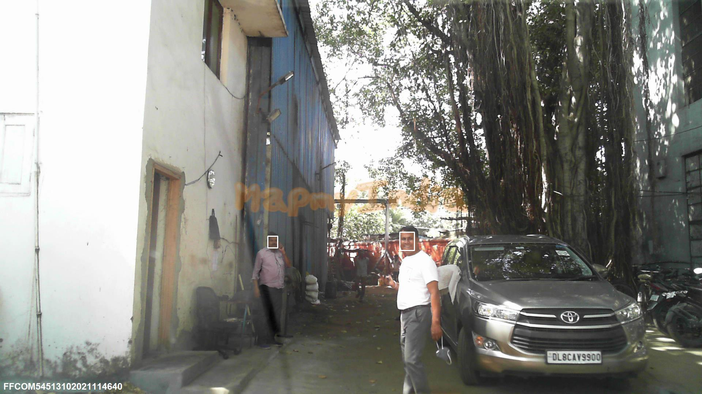
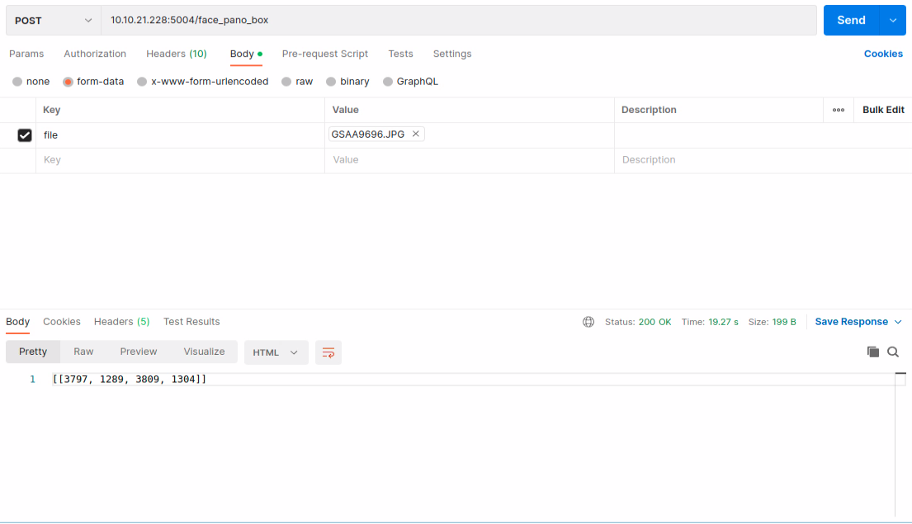
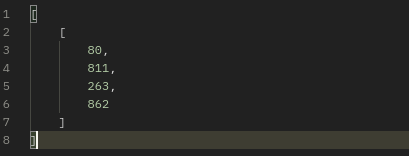
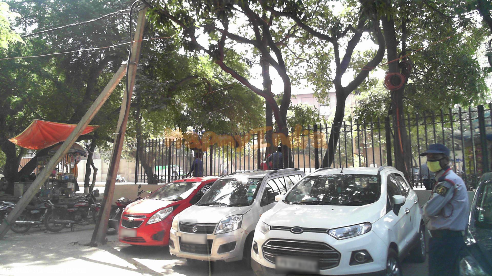
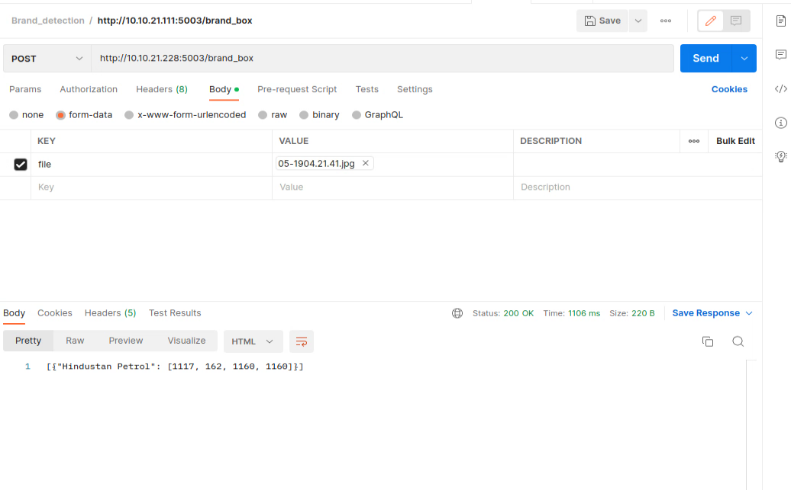

[ 
](https://about.mappls.com/api/)

# MAPPLS AI / ML APIs

## Introduction
Using these APIs developers can fully leverage and embed the power of AI / ML Analytics,  intelligence. These APIs allow our client to integrate  the power of detection and blurring faces/license plates as per the their own requirement and full set of functionalities via this API. Moreover, A new API which has the feature of blurring the object as the user/ Client needs.

- [Face Detection & Blurring API](#face-detection--blurring-api )
- [License Plate Detection & Blurring API](#license-plate-detection--blurring-api)
- [Brand Detection API](#brand-detection-api)
- [New Object blurring API](#new-object-blurring-api)

## Face Detection & Blurring API

It’s a fact: people have a right of getting  digital privacy. Here’s one more: online publishers and businesses worldwide must respect those rights and provide visual anonymity when it’s needed. That’s why we decided to give you the fastest and easiest way to keep people’s privacy in photos. Meet Face Detection & Blurring  by MapmyIndia.

 

This tool completely automates Face Detection, Face Blurring in photos and helps you get the job done in just a few clicks without graphic editors and manual work. Keep reading to find out how it works, when it comes in handy, and how you can actually use it in MapmyIndia.

 

You can detect faces in an image, identify key facial features, and get the contours of detected faces. Note that the API detects faces, it does not recognize people .

Also, if you have any difficulties using this feature or suggestions on how we can improve the existing functionality, feel free to create a post in our Community Area.

 

- [Face Detection ](#face-detection )
- [ Face plot](#face-plot)
- [Face Blurring](#face-blurring)
- [Face Detection - Panoramas ](#face-detection---panoramas )
- [ Face plot - Panoramas](#face-plot---panoramas)
- [Face Blurring - Panoramas](#face-blurring---panoramas)

## Face Detection 
 
When you have face contour detection enabled, you also get a list of points for each facial feature that was detected. These points represent the shape of the feature. The following image illustrates how these points map to a face.
 

## Face plot 

 

Try face detection below. You can use the your own image in its place. Send the request to the API. The sample Result are  potrayed down below.

 

 

## Face Blurring
 
Face Blur API can automatically detect all faces within an image and blurs them.
No need for manual face selection.

Get up and running quickly. Implement Face Blur API in your stack with just one API call.

 

 

## Face Detection - Panoramas
 
When you have face contour detection enabled on panoramas, you also get a list of points for each facial feature that was detected. These points represent the shape of the feature. The following image illustrates how these points map to a face.
 

 

## Face plot - Panoramas

 

Try face detection below for panoramas. You can use the your own image in its place. Send the request to the API. The sample Result are  potrayed down below.

 

 

## Face Blurring - Panoramas
 
Face Blur API can automatically detect all faces within panoramas and blurs them.
No need for manual face selection.

Get up and running quickly. Implement Face Blur API in your stack with just one API call.

 

 

This API Answers to every Question  regarding face Detection & Blurring, such as :

1. Are there any faces of Human in the Image?
2. Where the faces of Human in the Image?
3. Can it return the location of the faces of Human?
4. Can it plot the located boxes on the Image?
5. Is the API able to blur the faces of Human detected ?
6. Is It possible to Blur the image by giving the  boxes where the face lies ?
 

### Features Highlights

1. Helps find missing people
2. Protects businesses against theft
3. Strengthens security measures
4. Reduces the number of touchpoints
5. Improves photo organizations
 
 
 

## License Plate Detection & Blurring API

Using these APIs anybody can detect and blur the license plate in street images or in panoramas. These APIs allow our client to use the power of Automatic License Plate detection from images and Finding ROI( Region of Interest) of License Plate as per the client requirement.
This model has been implemented on Yolo_v5 model that effectively detect License Plate area by exploring each object region.

 

This tool completely automates License Plate Detection, License Blurring in photos and helps you get the job done in just a few clicks without graphic editors and manual work. Keep reading to find out how it works, when it comes in handy, and how you can actually use it in MapmyIndia.

 

You can detect License plates in an image, identify key its features, and get the contours of detected License plates.

Also, if you have any difficulties using this feature or suggestions on how we can improve the existing functionality, feel free to create a post in our Community Area.

 

- [License Plate Detection](#license-plate-detection)
- [License Plate plot](#license-plate-plot)
- [License Plate Blurring](#license-plate-blurring)
- [License Plate Detection - Panoramas](#license-plate-detection)
- [License Plate Plot - Panoramas](#license-plate-plot)
- [License Plate Blurring - Panoramas](#license-plate-blurring)

## License Plate Detection 
 
When you have license plate contour detection enabled, you also get a list of points for each License Plate feature that was detected. These points represent the shape of the feature. The following image illustrates how these points map to a license plate.

 

 

## License Plate plot 

 

Try license plate detection below. You can use the your own image in its place. Send the request to the API. The sample Result are  potrayed down below.

 

 

## License Plate Blurring
 
License Plate Blur API can automatically detect all faces within an image and blurs them.
No need for manual face selection.

Get up and running quickly. Implement License Plate Blur API in your stack with just one API call.

 

 

## License Plate Detection - Panoramas
 
To find the license plate contour features in panaramas, try box api, its sample results will be as below:

 

     
 

## License Plate plot - Panoramas

 

Try license plate detection below. You can use the your own image in its place. Send the request to the API. The sample Result are  potrayed down below.

 

 

## License Plate Blurring - Panoramas
 
License Plate Blur API can automatically detect all license plates within an image and blurs them.
No need for manual selection.

Get up and running quickly. Implement Face Blur API in your stack with just one API call.

 

 

### How Algorithm Works
 

First, the API takes input as an image. If the end user wants face/license plate detection then an image with bounding box on the faces/license plates would be displayed. However, if the end user wants face/license plate blurring then blurred image would be displayed in the API as an output. the algorithm adds a layer that blurs them out with Gaussian Blurring (also known as smoothing), which reduces image details so that facial/license plate features can no longer be seen by the human eye.
 

To test the application, upload a JPG, PNG file containing at least one face/license plate into the API. After a few seconds, the destination bucket contains the output file, with the same name. The output file shows blur content when the objects are detected:
All operations are done with MapmyIndia Face Detection & Blurring API and take just a few minutes to set up.
 
 

 

## Brand Detection API

Using these APIs Data Team can fully leverage and embed the power of AI Based Brand Detection from seen imagery data and Finding ROI( Region of Interest) of Detected brand detection as per the their own requirement.These ROI could be downloaded as a CSV file and used for data extraction.

This model has been implemented on YOLOv5 model that effectively detect Brand Detection. High robustness in real complex scenarios such as in cloudy, sunny, rainy and at night is achieved. Real-time detection upto 33 frames per second.

 

 

You can detect faces in an image, identify key facial features, and get the contours of detected faces. Note that the API detects faces, it does not recognize people .

Also, if you have any difficulties using this feature or suggestions on how we can improve the existing functionality, feel free to create a post in our Community Area.

 

- [Brand Detection](#brand-detection)
- [Brand Details](#brand-details)

 

## Brand Detection 
 
To detect brands like petrol pumps, banks etc, try following API which gives contour points of the brands detection boxes in image.

 

     
 

## Brand Details

 

Major brands detected under this APIs are:
1. Indian Oil 
2. Bharat Petroleum 
3. Hindustan Petroleum 
4. Essar Petroleum 
5. Axis Bank 
6. ICICI Bank 
7. HDFC Bank 
8. State Bank Of India 
9. Canara Bank

## Features Highlights

This API Answers to every Question  regarding face Detection & Blurring, such as :
1. Accuracy: The API has high accuracy in detecting license plates in various lighting conditions, angles, and distances.
2. Speed: The API provides fast and real-time processing of images for quick responses.
3. Scalability: The API is able to handle multiple requests simultaneously and scale up or down depending on demand.
4. Security: The API ensures the privacy and security of user data and protects against potential attacks.
5. Error Handling: The API provides meaningful error messages in case of input validation failures or other errors.
6. Robustness: The API is able to detect license plates under various conditions such as low-resolution images, partial occlusion, and varying aspect ratios.
7. Customization: The API allows for fine-tuning or customization of the license plate detection model according to specific use cases or domains.
8. Integration: The API is easy to integrate into different systems and platforms using standard communication protocols such as REST API or JSON.
 

# New Object blurring API.

## Object Detection

## Introduction
 
Sending visuals that include customers’ personal information, employee data, or company secrets can lead to a multitude of issues. In fact, many countries (and even individual states) have laws that govern how personally identifiable information can be shared both inside and outside your organization.

Trust us, you never want to go through all the difficulties that improperly sharing private information can lead to.

What happens when you need or want to share an image, but there are elements of it that you’d rather not (or can’t let) people see?

You could remove info within your original document by restricting permissions or versions, but beware! There are ways to get around this type of security.

Thankfully, there’s a better (and easier!) way.

Blur it out!

An API to blur any kind of object on the image. User would give bounding box of the region he/she wants to blur and with it the image he wants the operation to be performed and our latest blurring  API would blur the specified region. 
 
 

This API has more advance features  in compare with the face blurring API
 

 

#### Documentation
[Click here](https://mappls-api.github.io/mappls-ai-apis/mgis-apis.html?urls.primaryName=Face%20Detection%20API%20%3E%20AI%2FML%20API)

 

 
For any queries and support, please contact: 

[ 
](https://about.mappls.com/api/)
Email us at [apisupport@mapmyindia.com](mailto:apisupport@mapmyindia.com)

[Support](https://www.mapmyindia.com/api/index.php#f_cont)
Need support? contact us!

  
  

[
  ](https://stackoverflow.com/questions/tagged/mappls-api)[ 
](https://www.npmjs.com/org/mapmyindia) 

[
  ](https://www.facebook.com/Mapplsofficial)

@ Copyright 2022 CE Info Systems Ltd. All Rights Reserved.

 <a href="https://about.mappls.com/api/terms-&-conditions">Terms & Conditions</a> | <a href="https://about.mappls.com/about/privacy-policy">Privacy Policy</a> | <a href="https://about.mappls.com/pdf/mapmyIndia-sustainability-policy-healt-labour-rules-supplir-sustainability.pdf">Supplier Sustainability Policy</a> | <a href="https://about.mappls.com/pdf/Health-Safety-Management.pdf">Health & Safety Policy</a> | <a href="https://about.mappls.com/pdf/Environment-Sustainability-Policy-CSR-Report.pdf">Environmental Policy & CSR Report</a>

Customer Care: +91-9999333223

