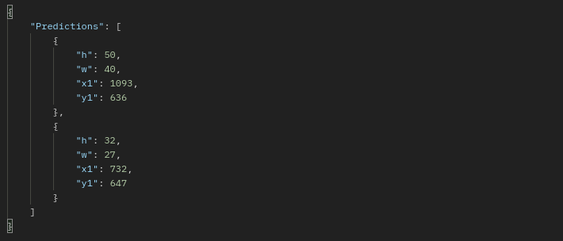
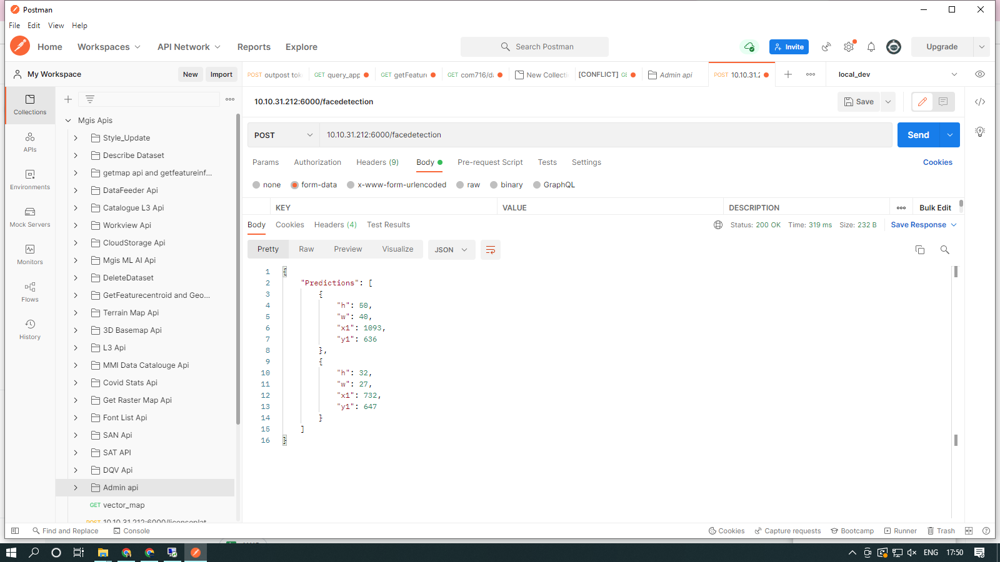

# MapmyIndia AI / ML APIs

## Introduction
Using these APIs developers can fully leverage and embed the power of AI / ML Analytics,  intelligence. These APIs allow our client to integrate  the power of detection and blurring faces as per the their own requirement and full set of functionalities via this API.

## Face Detection & Blurring API

It’s a fact: people have a right of getting  digital privacy. Here’s one more: online publishers and businesses worldwide must respect those rights and provide visual anonymity when it’s needed. That’s why we decided to give you the fastest and easiest way to keep people’s privacy in photos. Meet Face Detection & Blurring  by MapmyIndia.

 

This tool completely automates Face Detection, Face Blurring in photos and helps you get the job done in just a few clicks without graphic editors and manual work. Keep reading to find out how it works, when it comes in handy, and how you can actually use it in MapmyIndia.

 

You can detect faces in an image, identify key facial features, and get the contours of detected faces. Note that the API detects faces, it does not recognize people .

Also, if you have any difficulties using this feature or suggestions on how we can improve the existing functionality, feel free to create a post in our Community Area.

 

## Face Detection 
 
When you have face contour detection enabled, you also get a list of points for each facial feature that was detected. These points represent the shape of the feature. The following image illustrates how these points map to a face.
 

 

## Face plot 

 

Try face detection below. You can use the your own image in its place. Send the request to the API. The sample Result are  potrayed down below.

 

 

## Face Blurring
 
Face Blur API can automatically detect all faces within an image and blurs them.
No need for manual face selection.

Get up and running quickly. Implement Face Blur API in your stack with just one API call.

 

 

This API Answers to every Question  regarding face Detection & Blurring, such as :

1. Are there any faces of Human in the Image?
2. Where the faces of Human in the Image?
3. Can it return the location of the faces of Human?
4. Can it plot the located boxes on the Image?
5. Is the API able to blur the faces of Human detected ?
6. Is It possible to Blur the image by giving the  boxes where the face lies ?
 

## Features Highlights
 

1. Helps find missing people
2. Protects businesses against theft
3. Strengthens security measures
4. Reduces the number of touchpoints
5. Improves photo organizations
 

## How Algorithm Works
 

First, the API takes input as an image. If the end user wants face detection then an image with bounding box on the faces would be displayed. However, if the end user wants face blurring then face blurred image would be displayed in the API as an output. the algorithm adds a layer that blurs them out with Gaussian Blurring (also known as smoothing), which reduces image details so that facial features can no longer be seen by the human eye.
 

To test the application, upload a JPG, PNG file containing at least one face into the API. After a few seconds, the destination bucket contains the output file, with the same name. The output file shows blur content when the faces are detected:
All operations are done with MapmyIndia Face Detection & Blurring API and take just a few minutes to set up.
 
 

## SNAPSHOT(s)

 
 
 
 

# ALERT 
 

#  WANTS TO BLUR ANYTHING ON THE IMAGE ????  HERE IS BLURRING API
 
 

# Introduction
 
Sending visuals that include customers’ personal information, employee data, or company secrets can lead to a multitude of issues. In fact, many countries (and even individual states) have laws that govern how personally identifiable information can be shared both inside and outside your organization.

Trust us, you never want to go through all the difficulties that improperly sharing private information can lead to.

What happens when you need or want to share an image, but there are elements of it that you’d rather not (or can’t let) people see?

You could remove info within your original document by restricting permissions or versions, but beware! There are ways to get around this type of security.

Thankfully, there’s a better (and easier!) way.

Blur it out!

A API to blur any kind of object on the image. User would give bounding box of the region he/she wants to blur and with it the image he wants the operation to be performed and our latest blurring  API would blur the specified region. 
 
 

This API has more advance features  in compare with the face blurring API
 

 

#### Documentation
[Click here](https://mapmyindia.github.io/mappls-ai-apis/mgis-apis.html?urls.primaryName=Face%20Detection%20API%20%3E%20AI%2FML%20API)

 

 
For any queries and support, please contact: 

Email us at [apisupport@mapmyindia.com](mailto:apisupport@mapmyindia.com)

[Support](https://www.mapmyindia.com/api/index.php#f_cont)
Need support? contact us!

 

 

[)](https://twitter.com/MapmyIndia)[)](https://www.linkedin.com/company/mapmyindia)[)](https://www.youtube.com/user/MapmyIndia/)

@ Copyright 2020 CE Info Systems Pvt. Ltd. All Rights Reserved.

 <a href="https://www.mapmyindia.com/api/terms-&-conditions">Terms & Conditions</a> | <a href="https://www.mapmyindia.com/about/privacy-policy">Privacy Policy</a> | <a href="https://www.mapmyindia.com/pdf/mapmyIndia-sustainability-policy-healt-labour-rules-supplir-sustainability.pdf">Supplier Sustainability Policy</a> | <a href="https://www.mapmyindia.com/pdf/Health-Safety-Management.pdf">Health & Safety Policy</a> | <a href="https://www.mapmyindia.com/pdf/Environment-Sustainability-Policy-CSR-Report.pdf">Environmental Policy & CSR Report</a>

Customer Care: +91-9999333223

